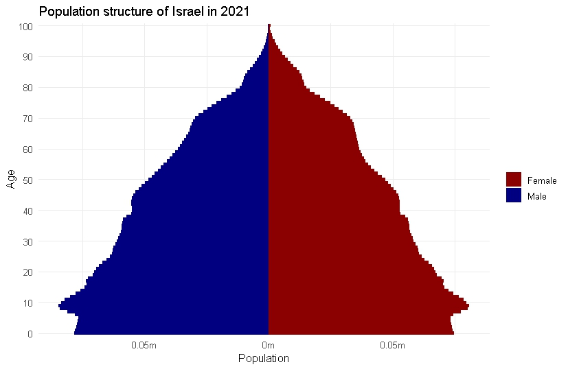
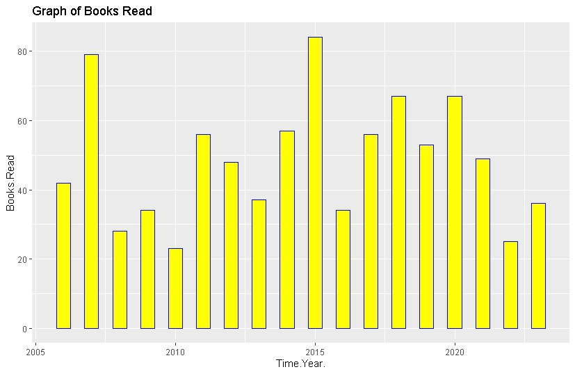

## Description of Assignment 3 

### Plot 1: Percentage of blacks in Polk County
The first plot was a plot showing percentage of blacks by census tracts in Polk County, Iowa. I plotted the map using the Thematic Map (tm) package

### Plot 2: Population Pyramid of Israel
The second plot is a population pyramid of Israel. I plotted that using the idbr package

### Plot 3: Books Read Graph
The third plot is a graph showing the number of books read by an individual in different years. I pulled the data from a csv file

