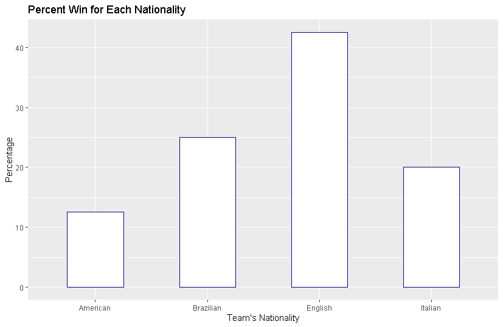
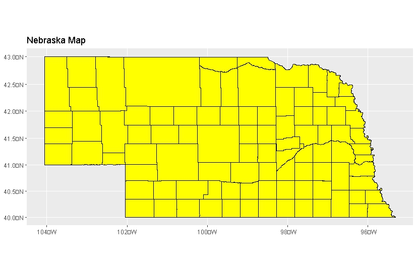

## Assignment 2 

### Plot 1: Percentage wins of nationalites
The first plot was a plot showing percentage wins of different nationalites form a data I pulled for google sheets

### Plot 1: Nebraska map
The second plot is a map of the state of Nebraska

